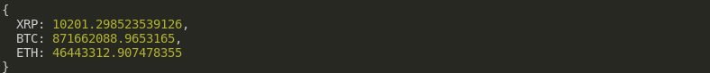

## BLOCKCHAIN USD LEDGER
Given a CSV file at the [data directory](https://raw.githubusercontent.com/zecollokaris/Bitcoin-Usd-Ledger/master/data/transactions.csv) of transactions in a crypto wallet, The application should print balances of all tokens in USD, leveraging on cryptocompare conversion API.

## Problem Breakdown

My solution has 3 steps:

1. Converting the transactions csv file to a JSON array in memory
2. Sorting the array from most recent to least recent timestamp
3. Printing the balances after adding or subtracting a token amount based on its transaction type.

## Steps Breakdown

### **Converting provided CSV to JSON Array of objects**
This step leverages **convert-csv-to-json** (npm module to convert csv to json).

### **Sorting the JSON Array**
I leverage JS ```.sort()``` to sort transactions by timestamp in descending order

### **Printing and calcualting the balances**
- By starting from the least recent  to the most recent transaction, my algorithm has a token balance at each iteration/transaction.
- By use of an object, I store an individual token balance by adding an element amount to the balance (if it has the transaction type of DEPOSIT) or deducting it if it has the transaction type of withdraw.
- A varible named ```factor``` then exists to easen the logic for adding or subtracting without the need of nested ifs or tenary operators which makes the code more readable.
- If the token exists in the balance then multiply the factor by the amount and add it to the token balance, if not just mulitply the factor with the amount and store it as starting balance for said token
- The last step is to convert the token balances to USD as directed. I created a function ```getRate(from: String, to: String)``` to create a promise which later resolves to return the desired conversion (in this case conversion from token to USD)

## Point to note
The least transaction based on timestamp was a withdrawal, it was unclear if this needs to be the case as it creates a deficit in the token balance.

## Prerequisite

Make sure you have node and npm installed

## How run it

```npm install```

This will install all required node modules


```npm run start```

To run the code provided

You should get the output below on runing this project

